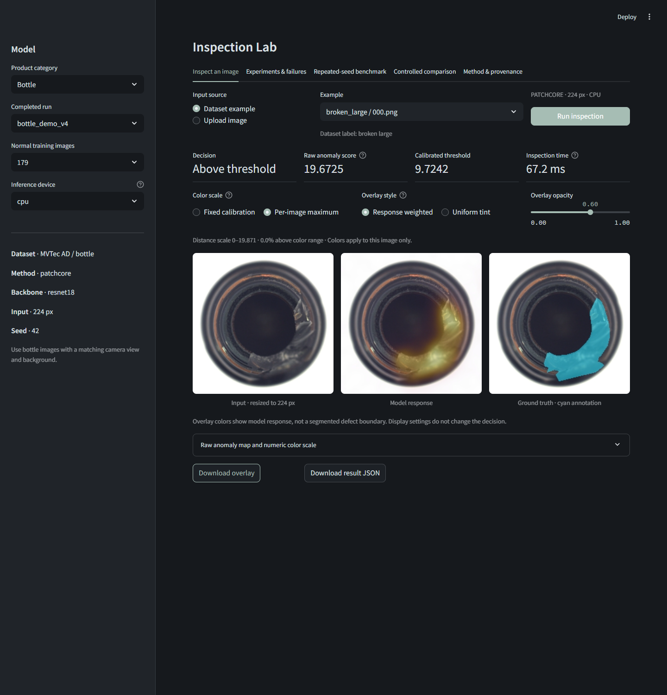
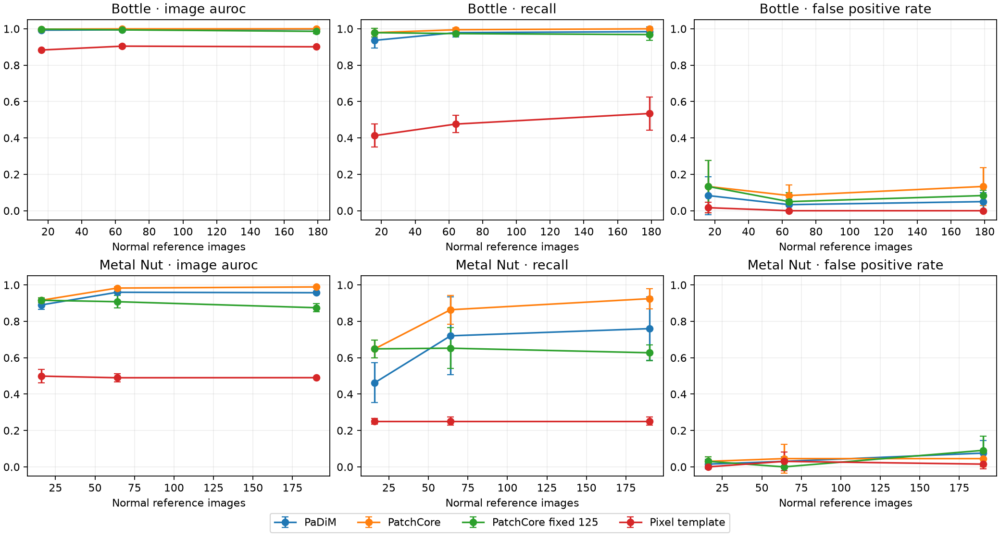

# Inspection Lab

**Industrial anomaly inspection with normal-only calibration and reproducible comparisons.**

Train on normal references, calibrate on separate normal images, inspect defects, and audit
reported metrics. Includes an English local UI and a batch inference command.



*Dataset imagery: MVTec AD, MVTec Software GmbH, CC BY-NC-SA 4.0. Cyan regions are dataset
annotations; colored heatmaps are model outputs. See [attribution](THIRD_PARTY.md).*

## Inspection display

The inspection view aligns the input, model response and dataset annotation. By default,
per-image scaling and response-weighted opacity leave low-response regions close to the
original image. Fixed calibration scaling and uniform tint remain available. The raw map
has a numeric color bar and can be downloaded. Display changes never change image scores,
thresholds or decisions. Benchmark metrics are shown separately under Experiments & failures.

## What is included

- Two products: bottle and metal nut, independently fitted and calibrated.
- Three methods: Anomalib PatchCore, Anomalib PaDiM, and a pixel-template baseline.
- Three paired seeds, nested reference budgets, and a fixed 125-patch PatchCore experiment
  to separate reference budget from final memory-bank capacity.
- Thirty held-out normal images calibrate each model. Test anomalies never fit thresholds
  or select the default checkpoint.
- Bounded uploads, batch prediction, failure review, numeric heatmaps and CSV/JSON downloads.
- Public predictions, calibration scores, split/source hashes and an evidence verifier.

## Results



Error bars show sample standard deviation across seeds 42, 123 and 2026. They measure split
sensitivity on reused test sets, not population confidence. Read the
[controlled comparison](results/controlled_v4/REPORT.md) for all methods and budgets.
The original [bottle](results/bottle_cpu_v2/REPORT.md) and
[metal-nut](results/metal_nut_cpu_v3/REPORT.md) studies also include dim/blur stress tests.

Original largest-budget PatchCore means:

| Category | References | Image AUROC | Recall | Normal false alarms |
|---|---:|---:|---:|---:|
| Bottle | 179 | 1.0000 | 100.0% | 13.3% |
| Metal nut | 190 | 0.9891 | 92.5% | 4.5% |

AUROC measures ranking; recall and false alarms use the normal-calibrated threshold.
Only 20/22 normal test images are available. Results do not establish factory readiness.

## Install: CPU first

Use **Python 3.11**. From the repository root:

```bash
python -m venv .venv
```

Activate with `.venv\Scripts\Activate.ps1` in Windows PowerShell, or
`source .venv/bin/activate` on Linux. Then:

```bash
python -m pip install --upgrade pip
python -m pip install torch==2.6.0 torchvision==0.21.0 --index-url https://download.pytorch.org/whl/cpu
python -m pip install -e ".[dev]"
python -m pytest -q
python -m inspection.evidence
```

The optional real-checkpoint test skips in a fresh checkout. Other tests need no benchmark
or pretrained-weight downloads. Windows CPU installation was tested locally. The included
Windows/Linux GitHub Actions workflow checks each push and pull request.
See [reproducibility](docs/REPRODUCIBILITY.md).

For NVIDIA CUDA 12.4, replace the CPU index with `https://download.pytorch.org/whl/cu124`.

## Run

```bash
python -m streamlit run app.py --server.address 127.0.0.1
```

Open http://127.0.0.1:8501. Without checkpoints, the app displays published evidence.
For interactive inference, download `inspection-lab-models-v0.4.2.zip` from the
[v0.4.2 release](https://github.com/supercoderrrrr/inspection-lab/releases/tag/v0.4.2),
check its SHA-256 against `SHA256SUMS.txt`, and extract it into the repository root.
Then select **Upload image**. The bundle contains two
prespecified seed42 models and metadata, with no dataset images.

Alternatively, train locally:

```bash
python -m inspection.data --category bottle
python -m inspection.experiment --category bottle --device cpu --robustness --name bottle_local
```

For dataset examples, run the download command even when using the model bundle. Initial
training downloads pretrained weights; saved checkpoints support offline inference.
Restart Streamlit after code changes. `Launch.cmd` is a Windows shortcut.

For data stored elsewhere, set `INSPECTION_DATA_ROOT` to the parent containing `bottle/`
and `metal_nut/`. `INSPECTION_MODEL_ROOT` can override the `artifacts/` directory.
Uploads accept PNG/JPEG up to 10 MB and 20 megapixels. GitHub stores the project;
the Streamlit application runs locally on each user's machine.

The earlier `python -m inspection fit`, `predict`, `evaluate` and `verify-results`
commands remain available for the initial `metadata.json` checkpoint format.
The complete study runner and UI use sealed experiment directories (`config.json`,
`n<budget>/model.pt`). Refit using `inspection.experiment` or use the release bundle
to inspect interactively; the two checkpoint formats are not interchangeable.

## Reproduce studies

```bash
python -m inspection.data --category bottle
python -m inspection.data --category metal_nut
python -m inspection.study --name bottle_cpu_v2 --device cpu
python -m inspection.study --category metal_nut --name metal_nut_cpu_v3 --device cpu
python -m inspection.research --name controlled_v4
python -m inspection.doctor --verify-data
```

Plans are saved before execution; completed runs are checked before reuse. Incomplete runs
are preserved. The controlled study verifies identical split hashes. It is an exploratory
follow-up to the original studies, not a preregistered external validation study.

These full studies were implemented and run in the earlier project workspace before
the staged Git repository was assembled. Experiment timestamps and source hashes
remain unchanged. The [initial comparison](docs/INITIAL_COMPARISON.md) and its evidence
are also retained. See [staged validation](docs/STAGED_VALIDATION.md) for earlier checks.

## Batch inference and custom products

```bash
python -m inspection.predict --checkpoint artifacts/bottle_demo_v4/n179/model.pt --input my-images --output artifacts/batch_001 --overlays
```

Invalid images are reported individually. See [custom data](docs/CUSTOM_DATA.md) for
training on another product and annotation requirements.

## Architecture

```text
Normal images -> disjoint fitting/calibration split -> nested budgets
              -> PatchCore / PaDiM / pixel template -> calibrated threshold
              -> untouched test evaluation -> CSVs + hashes -> public evidence

File or upload -> bounded decoder -> saved detector -> score + map -> UI / batch output
```

| Module | Responsibility |
|---|---|
| protocol.py | Splitting, calibration and image metrics |
| model.py, baseline.py | Detector adapters and simple comparator |
| experiment.py, study.py, research.py | Individual runs and controlled experiments |
| doctor.py, evidence.py | Local artifact and public evidence verification |
| predict.py, app.py | Batch and interactive inference |
| release.py | Public evidence, source archive and model bundle |

## Scope and provenance

PatchCore and PaDiM are imported from Anomalib. Project-specific work covers evaluation,
paired comparisons, fixed-capacity experiments, audits, reporting and the UI. Development
is AI-assisted. No claim is made to have invented the upstream algorithms.

The root MIT license covers project-authored code. Dependencies, weights and MVTec-derived
images retain separate terms. See [THIRD_PARTY.md](THIRD_PARTY.md),
[MODEL_CARD.md](MODEL_CARD.md), [technical report](docs/TECHNICAL_REPORT.md),
[release notes](docs/RELEASE_NOTES.md) and [contributing](CONTRIBUTING.md).

See the [release validation record](docs/VALIDATION.md) and [GitHub publishing guide](docs/PUBLISHING.md).
