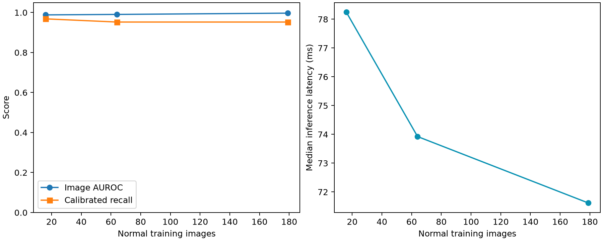

# Inspection Lab — Experiment Report

## Question
How does the number of normal reference images affect industrial anomaly detection,
and how stable is the largest prespecified model under controlled image perturbations?

## Method
This application uses Anomalib's `padim` implementation.
The backbone is `resnet18` with ImageNet pretrained weights,
layer1/layer2/layer3 features, 100 randomly selected dimensions and regularized Gaussian patch distributions, 224 × 224 RGB inputs and ImageNet normalization. This compact configuration is not a reproduction
of the original paper's headline benchmark. No gradient-based fine-tuning is performed.

## Evaluation protocol
- Dataset: original MVTec AD, bottle category; 209 normal training images and 83 official test images.
- Hold out 30 normal training images for calibration before selecting nested training budgets.
- Training budgets: [16, 64, 179]; seed: 123.
- Select the upper split-conformal order statistic at alpha=0.05 from normal calibration scores.
- Predict anomaly only when the raw image score strictly exceeds this threshold.
- Test labels and masks do not participate in fitting, calibration, or default-model selection.
- The default model uses the largest prespecified budget, regardless of test scores.
- Thresholds stay fixed for brightness ×0.7 and Gaussian blur radius 1.5 stress tests, when enabled.
- Pixel AUROC uses nearest-neighbor resized ground-truth masks at the input resolution.
- Latency uses a warmed-up model, batch size one, and device synchronization; decoding and preprocessing are excluded.

## Recorded results
| budget | condition | image_auroc | pixel_auroc | recall | false_positive_rate | latency_median_ms |
|---|---|---|---|---|---|---|
| 16 | clean | 0.9881 | 0.9773 | 0.9683 | 0.2000 | 78.2497 |
| 64 | clean | 0.9905 | 0.9792 | 0.9524 | 0.0000 | 73.9245 |
| 179 | clean | 0.9968 | 0.9782 | 0.9524 | 0.0000 | 71.6157 |

## Interpretation and limitations
AUROC measures ranking across thresholds. Recall and false-positive rate measure the
single threshold calibrated without anomalies; a high AUROC does not guarantee high recall
at this operating point. The nominal false-alarm level relies on exchangeable normal data,
not a guarantee on this small test set or on shifted deployment images.

These are one-category, one-seed observations. PaDiM uses the same feature dimensionality across budgets. Synthetic brightness/blur tests do not establish real-factory
robustness. The dataset has 20 normal and 63 anomalous test images, so each normal error changes
the observed false-positive rate by 5.00 percentage points. Scores are distances, not probabilities.
Heatmap colors use a calibration-derived fixed scale, not a validated pixel decision threshold.

## Reproducibility
See `config.json`, `environment.json`, `splits.json`, `summary.csv`, and the per-budget
calibration/prediction CSV files. Splits include image SHA-256 hashes. Checkpoints contain
tensor state and configuration; load only artifacts from a trusted source.

## Attribution and contribution
Upstream: Anomalib (Apache-2.0), PatchCore (Roth et al., CVPR 2022), and MVTec AD
(Bergmann et al., CVPR 2019; dataset CC BY-NC-SA 4.0).
Project-specific work: split/calibration protocol, nested budget experiments, stress tests,
artifact provenance, English inspection UI, and generated reporting. Development is AI-assisted.
No claim is made that the upstream detector was authored by the project owner.
